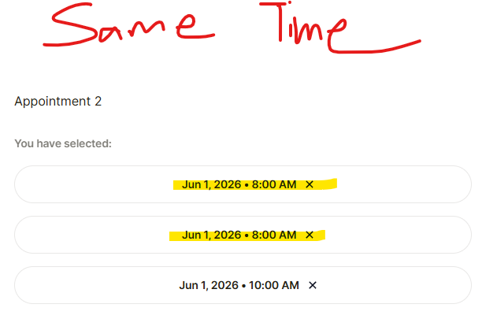

NOTE: See **ASSIGNMENT_ANSWERS.md** for answers to the interview questions.

# HOW TO RUN THE TESTS
- In your terminal:
    - Download `Node.js` (comes with `npm`)
        - **WINDOWS**
            - Go [here](https://nodejs.org/en/download) and download the LTS installer (.msi) for Windows.
            - Run the installer and keep the default options checked, especially:
                - "Add to PATH"
                - "Install npm"
        - **MAC**
            - You can follow the Windows instructions, or if you have [Homebrew](https://brew.sh) installed you can use this command: `brew install node`
        - **LINUX**
            - Run these commands:
                - `sudo apt update`
                - `sudo apt install nodejs npm`
    - Open a new terminal and verify the installation with:
        - `node -v`
        - `npm -v`

    - Navigate to the root of this repo and run this command: `npm i` to install the dependencies.
        - NOTE: This is only necessary if you haven't installed them, or if changes were made to the dependencies.
    - Run: `npx playwright install`
    - Finally, run: `npm run test:headed` to run the tests.
    - Other options include: 
        - `npm run test` if you dont want Chrome to open while the tests are running.
        - `npm run test:debug` if you want to run the tests in debug mode, thus letting you step through every line of code that runs.

# OTHER INFO ABOUT THE REPO
- The `src` directory contains all the tests and relevant code.
- In the `src` directory, you'll find these directories:
    - `components` for certain classes that dont pertain to pages themselves but are _aspects_ of pages.
    - `constants` for types and constant variables that other files import.
    - `enums` for enums.
    - `fixtures` for test data.
    - `functions` for functions that dont belong to any class.
    - `pages` for classes that represent pages.
    - `scratch-work` for miscellaneous work that is irrelevant to the final product but helped me gain context and insights.
    - `tests` for the tests.
    - `workflows` for classes that use pages in ways that tests require.

# AUTOMATED TEST CASES AND WHY I CHOSE THEM
Out of the 15 test cases that I created (see **ASSIGNMENT_ANSWERS.md**), I chose to automated these ones:
- Verify that the member's age must be 18yrs or older.
    - REASONING: 
        - If we allow minors to book scans, that would cause legal problems. (Lack of Informed Consent)
    - TRADE-OFFS/ASSUMPTIONS
        - Im assuming we want to avoid legal problems at all costs. Otherwise, this wouldn't be the top-ranked test.
- Verify that each checkout type works
    - REASONING: 
        - If a member is prevented from paying, then they can't complete the booking process. Their frustration will damage our reputation.
        - Also, since payment is the final step, the test ended up completing the entire booking process which is a handy end-to-end scenario.
    - TRADE-OFFS/ASSUMPTIONS
        - For whatever reason, the `Google Pay` option doesn't appear when Playwright is driving, nor in incognito mode. I tested it a bunch manually though. We'll just have to assume that it works.
        - As of 5/23 `Affirm` started asking for email verification (_my tests are using fake emails so that's not gonna happen_). Until then, the `Affirm` test was passing.
        - As of 5/23, I noticed `Klarna` had been added as a payment method. In the interest of time, this will be skipped.

# SCALABILITY
- Having directories for fixtures, pages, workflows, etc makes thing very modular and reusable. This improves scalability by allowing seemless integration of all the pieces.
- If a new page was added to the booking flow, we'd just need to create a class for it and add a function to the `completeBookingWorkflow` that interacts with the necessary elements. Then call that function in the e2e booking flow tests.

# FUTURE CHANGES
- In the future, I would probably extract the `Affirm` functionality from the `ReserveAppointment` class and put it in its own class and add it to the `pages` directory.
- Similarly, I would extract the `Link` functionality from the `bankCheckout()` function in the `ReserveAppointment` class and put it in its own class and add it to the `components` directory.
- I'd also like to add tests that use the `Back` button.

# BUGS AND OTHER ISSUES
- Duplicate appointment bug
```
- GIVEN you've selected all necessary dates and times on the `Schedule Scan` page.
- GIVEN you continue to the `Reserve Appointment` page
- WHEN you select the "Back" button thus returning to the `Schedule Scan` page and deselect one of the previously chosen appointment times
- THEN you will be able to select a date-time that is already selected.
```

